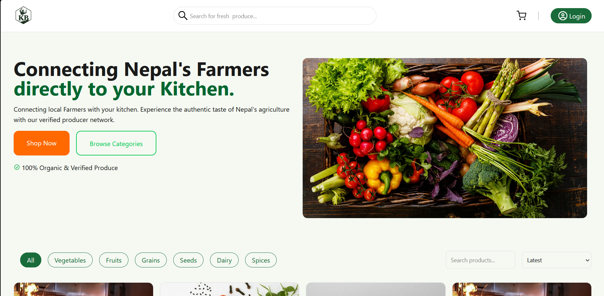
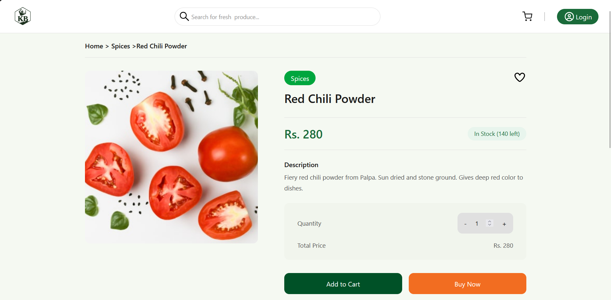
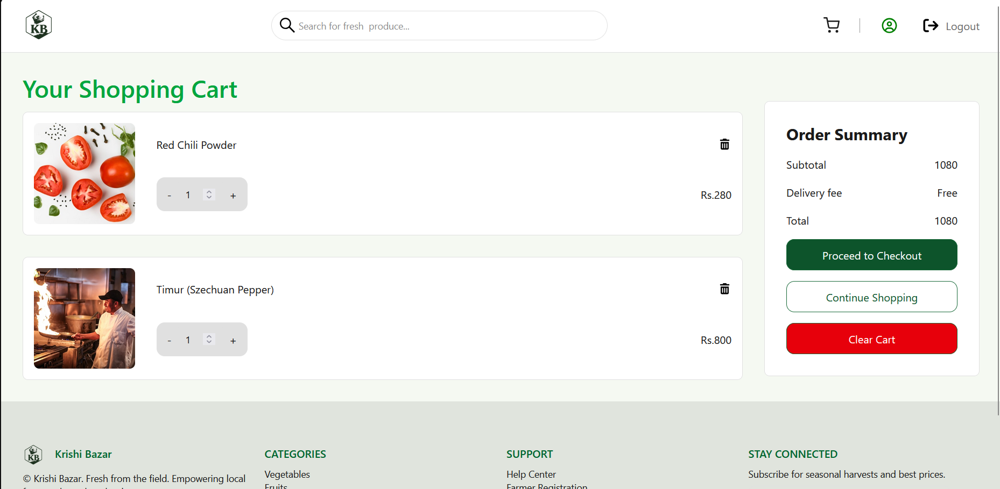
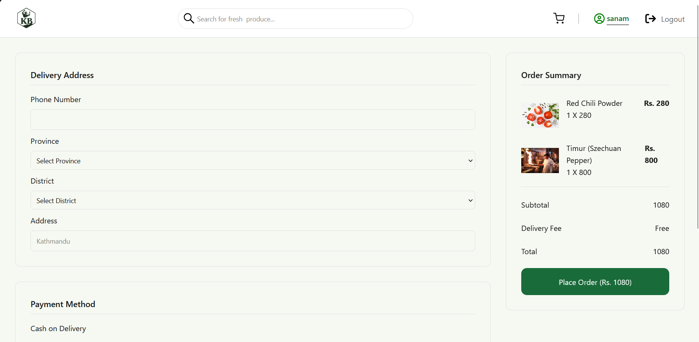
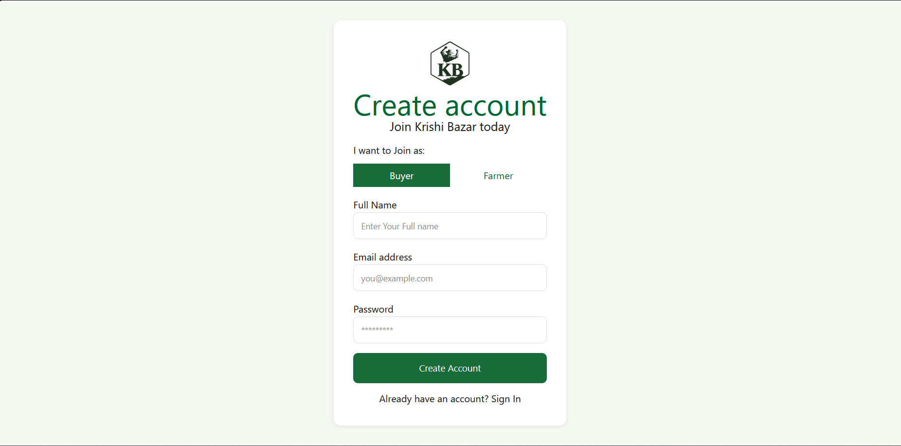

# 🌾 Krishi Bazar — Agricultural E-Commerce Marketplace

> Connecting Nepal's farmers directly to your kitchen. A full-stack MERN e-commerce platform where farmers list produce and buyers purchase directly — fresh from the field.

**🔗 Live Demo:** [krishi-bazar-alpha.vercel.app](https://krishi-bazar-alpha.vercel.app) &nbsp;|&nbsp; **Backend:** [krishi-bazar-backend.onrender.com](https://krishi-bazar-backend.onrender.com)

---

## 📸 Screenshots

### Home Page

> *Product listing with category filters, search, sort, and pagination*

### Product Page

> *Product details with quantity picker, Add to Cart and Buy Now*

### Cart Page

> *Cart management with live quantity updates and order summary*

### Checkout Page

> *Province/district dropdown, address form, and order summary*

### Login & Register

> *JWT-secured authentication with role selection (Buyer / Farmer)*

---

## ✨ Features

**Authentication**
- JWT-based login and registration
- bcrypt password hashing
- Role-based accounts — Buyer and Kishan (Farmer)
- Persistent login via localStorage token restore
- Protected routes on Cart and Checkout

**Product Catalogue**
- Browse all products with real-time search
- Category filter — Vegetables, Fruits, Grains, Seeds, Dairy, Spices
- Sort by latest, price low to high, price high to low
- Pagination with page navigation
- Empty state when no results found

**Cart System**
- Add to cart from product listing or product detail page
- Update quantity with live price calculation
- Remove individual items
- Cart count badge in Navbar
- Cart synced with MongoDB per user

**Checkout**
- Two checkout flows — Cart checkout and Buy Now (direct single product)
- Province and district dropdowns (all 7 provinces of Nepal)
- Address saved for future orders
- Cash on delivery payment

**Order System**
- Orders saved to database with product snapshots (price locked at time of order)
- Cart cleared automatically after successful order

**UX Polish**
- Skeleton loading screens on all data-heavy pages
- Custom in-app notification system (success and error toasts)
- Smooth scroll to product section on navigation
- Empty state illustrations
- Sticky navbar and footer always at bottom

---

## 🏗️ Tech Stack

| Layer | Technology |
|---|---|
| Frontend | React.js, Tailwind CSS, Axios, React Router v6 |
| State Management | React Context API, Custom Hooks |
| Backend | Node.js, Express.js |
| Database | MongoDB, Mongoose |
| Auth | JWT, bcrypt |
| Hosting | Render (Backend), Vercel (Frontend), MongoDB Atlas (DB) |

---

## 📁 Project Structure

```
krishi-bazar/
├── backend/
│   ├── config/
│   │   └── db.js                    # MongoDB connection
│   ├── controllers/
│   │   ├── authController.js
│   │   ├── productController.js
│   │   ├── cartController.js
│   │   ├── orderController.js
│   │   └── userController.js
│   ├── middleware/
│   │   └── authMiddleware.js        # JWT verification
│   ├── models/
│   │   ├── User.js
│   │   ├── Product.js
│   │   ├── Cart.js
│   │   └── Order.js
│   ├── routes/
│   │   ├── authRoutes.js
│   │   ├── productRoutes.js
│   │   ├── cartRoutes.js
│   │   ├── orderRoutes.js
│   │   └── userProfileRoutes.js
│   ├── seed/
│   │   └── seedProducts.js          # 55 dummy products
│   └── server.js
│
└── frontend/
    ├── src/
    │   ├── api/
    │   │   └── axiosInstance.js     # Base URL + JWT interceptor
    │   ├── components/
    │   │   ├── Navbar.jsx
    │   │   ├── Footer.jsx
    │   │   ├── ProductCard.jsx
    │   │   ├── ProductCardSkeleton.jsx
    │   │   ├── CartItem.jsx
    │   │   ├── Notification.jsx
    │   │   ├── SearchBar.jsx
    │   │   └── CategoryFilter.jsx
    │   ├── context/
    │   │   ├── AuthContext.jsx      # User, token, login, logout
    │   │   ├── CartContext.jsx      # Cart state + API calls
    │   │   └── NotificationContext.jsx
    │   ├── hooks/
    │   │   ├── useAuth.js
    │   │   ├── useCart.js
    │   │   └── useNotification.js
    │   ├── pages/
    │   │   ├── HomePage.jsx
    │   │   ├── ProductPage.jsx
    │   │   ├── CartPage.jsx
    │   │   ├── CheckoutPage.jsx
    │   │   ├── LoginPage.jsx
    │   │   ├── RegisterPage.jsx
    │   │   └── NotFoundPage.jsx
    │   └── routes/
    │       └── PrivateRoute.jsx
    └── public/
        └── logo.png
```

---

## 🚀 Getting Started

### Prerequisites
- Node.js v18+
- MongoDB Atlas account (or local MongoDB)

### 1. Clone the repo

```bash
git clone https://github.com/SanamRai001/krishi-bazar.git
cd krishi-bazar
```

### 2. Backend setup

```bash
cd backend
npm install
```

Create `.env`:

```
PORT=5000
MONGO_URI=your_mongodb_connection_string
JWT_SECRET=your_jwt_secret_key
NODE_ENV=development
```

Start the server:

```bash
npm run dev
```

### 3. Seed the database

```bash
node seed/seedProducts.js
```

This inserts 55 agricultural products across 6 categories with real Unsplash images.

### 4. Frontend setup

```bash
cd ../frontend
npm install
```

Create `.env`:

```
VITE_API_URL=http://localhost:5000/api
```

Start the dev server:

```bash
npm run dev
```

---

## 📡 API Endpoints

| Method | Endpoint | Auth | Description |
|---|---|---|---|
| POST | `/api/auth/register` | No | Register user |
| POST | `/api/auth/login` | No | Login, returns JWT |
| GET | `/api/products` | No | List products (search, filter, sort, page) |
| GET | `/api/products/:id` | No | Single product |
| POST | `/api/products` | Admin | Create product |
| PUT | `/api/products/:id` | Admin | Update product |
| DELETE | `/api/products/:id` | Admin | Delete product |
| GET | `/api/cart` | Yes | Get user cart |
| POST | `/api/cart` | Yes | Add item to cart |
| PUT | `/api/cart/:itemId` | Yes | Update quantity |
| DELETE | `/api/cart/:itemId` | Yes | Remove item |
| POST | `/api/order` | Yes | Place order |
| GET | `/api/user/profile` | Yes | Get user profile |
| PUT | `/api/user/profile` | Yes | Update profile and saved address |

---

## 🔐 Environment Variables

**Backend `.env`**

| Variable | Description |
|---|---|
| `PORT` | Server port (default 5000) |
| `MONGO_URI` | MongoDB Atlas connection string |
| `JWT_SECRET` | Secret key for signing JWT tokens |
| `NODE_ENV` | `development` or `production` |

**Frontend `.env`**

| Variable | Description |
|---|---|
| `VITE_API_URL` | Backend API base URL |

---

## 🚢 Deployment

**Backend → Render**
1. Push to GitHub
2. Create Web Service on Render
3. Set env vars (MONGO_URI, JWT_SECRET, NODE_ENV=production)
4. Build command: `npm install` · Start command: `node server.js`

**Frontend → Vercel**
1. Push to GitHub
2. Import project on Vercel
3. Set `VITE_API_URL` to your Render backend URL
4. Deploy

**Database → MongoDB Atlas**
1. Create free M0 cluster
2. Whitelist `0.0.0.0/0` for all IPs
3. Copy connection string to `MONGO_URI`

---

## 👨‍💻 Author

**Sanam Rai** — Kathmandu, Nepal

[Portfolio](https://sanam-rai.com.np) · [GitHub](https://github.com/SanamRai001) · [LinkedIn](https://linkedin.com/in/sanam-rai-6b2149212)

---

> Built as a portfolio project to demonstrate full-stack MERN development — from backend API design to production deployment.
